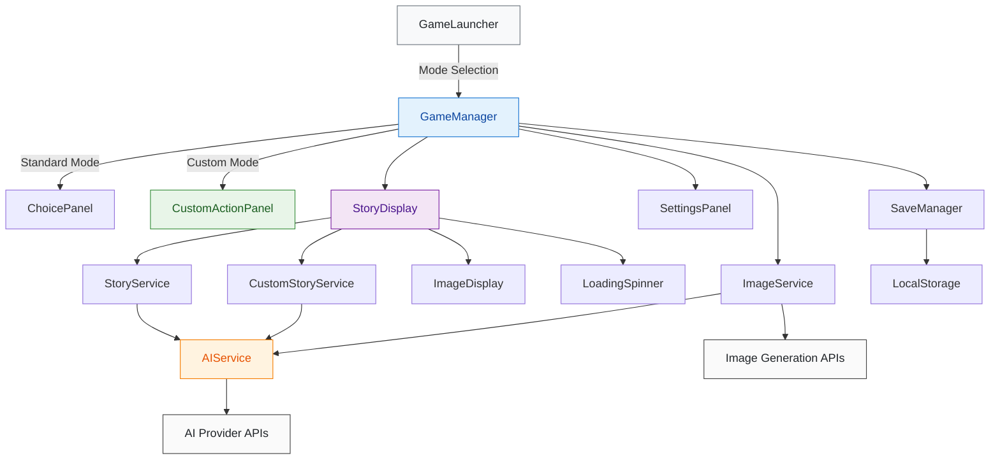

## My name is Rocket, and I have very little coding knowledge. I wanted to make this to have cool, professional looking, AI generated CYOA. 

## The project was meant to test Kiro, and it's spec driven process for two things. 
- A MVP that could deliver what I wanted. The ai writing the CYOA, and generating the choices.
- A custom mode so the user could make their own scene, and reply customly.

Then I just iterated, and interated more with agent mode, eventually I wanted to just expend the entire 500 credit limit I got to try Kiro on this project. As I am writing this, I used 408/500.

Everything else was generated in it's entirety by AI. At its heart its just a simple CYOA generater where you bring your own API key. It currently accepts openai compatible endpoints and anthropic. (I only tested Haiku and didn't feel like updating the model list manually, it's just what was coded for me.)

Image generation is done by either openai or nano-gpt. I was unable to test openai image gen because I'm not paying for it, but I got nano-gpt to work. It's simple, but works.

If anyone wants to take this project way further than I did, feel free. I know there are things like SillyTavern but this is just built for CYOA. One of my favorite kinds of games, and with AI it's much easier to make them.

If you want to try it out yourself. Try it on github pages [HERE](https://rocketdouble.github.io/ai-cyoa-game/)

Thank you for reading this. I hope you enjoy your own CYOA. Here is the README the ai wrote. 

# AI-Powered Choose Your Own Adventure Game

A sophisticated interactive storytelling experience built entirely with AI using **Kiro's Spec feature**. This project showcases the power of AI-driven development, where 100% of the code was generated through collaborative specification and implementation with Kiro.

## 🤖 Built with Kiro AI

This entire project was created as a showcase of what's possible with AI-assisted development using **Kiro's Spec feature**. From initial concept to final implementation, every line of code, component architecture, and feature was designed and built through AI collaboration.

### The Kiro Spec Approach
- **Specification-Driven Development**: Used Kiro's Spec feature to iteratively design and implement complex features
- **100% AI Generated**: No human-written code - everything was created through AI collaboration
- **Incremental Development**: Built feature by feature using structured specifications
- **Quality Assurance**: AI-driven testing and validation throughout development

## 🎮 Features

### Core Gameplay
- **Interactive Storytelling**: Dynamic, AI-generated narratives that adapt to your choices
- **Multiple Choice System**: Rich decision trees that shape your adventure
- **Custom Scenarios**: Create your own story prompts and themes
- **Save/Load System**: Persistent game states with multiple save slots
- **Story History**: Track your journey through previous choices and outcomes

### Advanced AI Features
- **Real-Time Text Streaming**: Character-by-character text generation
- **Dynamic Image Generation**: AI-generated scene illustrations for immersive storytelling
- **Story Regeneration**: Don't like a response? Regenerate it with variations
- **Intelligent Prompt Engineering**: Optimized prompts for consistent, engaging narratives

### User Experience
- **Dark/Light Mode**: Toggle between themes for comfortable reading
- **Responsive Design**: Works seamlessly on desktop and mobile devices
- **Accessibility**: Screen reader friendly with proper ARIA labels
- **Performance Optimized**: Fast loading with efficient state management

### Customization & Settings
- **AI Model Configuration**: Support for multiple AI providers and models
- **Sampler Settings**: Fine-tune temperature, min-p, and repetition penalty
- **Image Generation Toggle**: Enable/disable visual generation for faster gameplay
- **Streaming Toggle**: Choose between real-time streaming or instant text display

## 🛠 Technical Architecture

### Application Flow


### Frontend Stack
- **React 19** with TypeScript for type-safe component development
- **Vite** for lightning-fast development and optimized builds
- **Tailwind CSS** for responsive, utility-first styling
- **Context API** for efficient state management

### AI Integration
- **Streaming Support**: Server-Sent Events (SSE) for real-time text generation
- **Multi-Provider Support**: Compatible with various AI APIs
- **Intelligent Caching**: Optimized API usage and response handling
- **Error Recovery**: Robust error handling with retry mechanisms

### Testing & Quality
- **Vitest** for comprehensive unit and integration testing
- **TypeScript** for compile-time error prevention
- **ESLint** with strict rules for code quality
- **Component Testing** with React Testing Library

## 🚀 Getting Started

### Prerequisites
- Node.js 18+ 
- npm or yarn package manager

### Installation
```bash
# Clone the repository
git clone <repository-url>
cd ai-cyoa-game

# Install dependencies
npm install

# Start development server
npm run dev
```

### Configuration

#### Using Cloud AI Services
1. Open the game in your browser
2. Click "Settings" to configure your AI provider
3. Enter your API credentials and model preferences
4. Customize sampler settings and features as desired
5. Start your adventure!

#### Using Local LLMs (LM Studio)
You can use your own local LLM instead of cloud services:

1. **Install LM Studio**: Download from [lmstudio.ai](https://lmstudio.ai)
2. **Download a Model**: Choose any compatible model (e.g., Llama, Mistral, etc.)
3. **Enable CORS**: In LM Studio's server settings, enable CORS to allow web requests
4. **Start Local Server**: Start the local server (usually runs on `http://127.0.0.1:1234`)
5. **Configure Game**: 
   - Set Base URL to: `http://127.0.0.1:1234/v1`
   - Set API Key to any 8+ character string (e.g., `12345678` - not used by local server)
   - Select your loaded model

**Benefits of Local LLMs:**
- Complete privacy - no data leaves your machine
- No API costs or rate limits
- Works offline
- Full control over model selection

## 📁 Project Structure

```
src/
├── components/          # React components
│   ├── GameManager.tsx  # Main game orchestration
│   ├── StoryDisplay.tsx # Story rendering and UI
│   ├── SettingsPanel.tsx # Configuration interface
│   └── ...
├── services/           # Business logic and AI integration
│   ├── AIService.ts    # AI provider communication
│   ├── StoryService.ts # Story generation logic
│   └── ...
├── contexts/           # React context providers
├── types/             # TypeScript type definitions
├── utils/             # Utility functions and helpers
└── test/              # Test suites and fixtures
```

## 🎯 Key Features Deep Dive

### Real-Time Streaming
Experience stories as they unfold with character-by-character text streaming, similar to modern AI chat interfaces. Toggle between streaming and instant display based on your preference.

### Dynamic Image Generation
Each story scene can be accompanied by AI-generated illustrations that bring your adventure to life. Images are generated based on scene descriptions and can be toggled on/off for performance.

### Story Regeneration
Not satisfied with a story response? Use the regenerate feature to get variations while maintaining the same context and choice history.

### Custom Scenarios
Create personalized adventures by defining your own story prompts, themes, and settings. The AI adapts to your creative vision.

## 🧪 Development Scripts

```bash
# Development
npm run dev          # Start development server
npm run build        # Build for production
npm run preview      # Preview production build

# Testing
npm run test         # Run tests once
npm run test:watch   # Run tests in watch mode
npm run test:ui      # Open Vitest UI

# Code Quality
npm run lint         # Run ESLint
```

## 🌟 Showcase Highlights

This project demonstrates:
- **Complex State Management**: Multi-layered game state with persistent storage
- **Advanced AI Integration**: Streaming, error handling, and multi-provider support
- **Modern React Patterns**: Hooks, Context, and TypeScript best practices
- **Performance Optimization**: Efficient rendering and API usage
- **User Experience Design**: Intuitive interface with accessibility considerations
- **Comprehensive Testing**: Unit tests, integration tests, and error scenarios

## 🤝 AI Development Process

Built using Kiro's innovative Spec feature, this project showcases:
- **Iterative Specification**: Each feature was carefully specified before implementation
- **AI Collaboration**: Human creativity combined with AI technical execution  
- **Quality Assurance**: AI-driven testing and validation throughout development
- **Documentation**: Comprehensive documentation generated alongside code
- **Best Practices**: Modern development patterns and architectural decisions

## 📄 License

This project serves as a demonstration of AI-assisted development capabilities and is provided as-is for educational and showcase purposes.

---

*Built entirely with AI using Kiro's Spec feature - a testament to the future of collaborative human-AI development.*